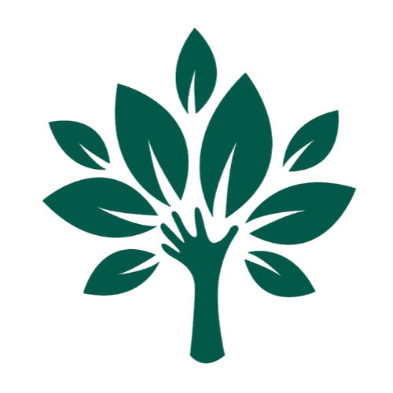

 <!-- colocar logo com texto kk-->
<!--  colocar logo com texto kk -->

<!--  colocar img da plataforma -->

<!-- [](https://pypi.org/project/)
[](https://pypi.org/project/) -->
<!-- [](https://github.com/UrbVerde/urbverde-ui/issues) -->
<!-- [](https://github.com/UrbVerde/urbverde-ui/discussions) -->


[](https://github.com/UrbVerde/urbverde-ui/actions)


[](./README_BR.md)
[](./README.md)
[](./README_FR.md)
<!-- [](./README_KR.md)
[](./README_CN.md)
[](./README_JA.md) -->

<!-- Bem-vindo ao projeto UrbVerde UI! Este repositório faz parte da iniciativa open-source UrbVerde, que visa democratizar dados ambientais e promover a sustentabilidade urbana. A interface foi projetada para oferecer uma plataforma intuitiva, rápida e altamente acessível para explorar insights geoespaciais e socioambientais. -->


<!-- ## 🔥 Novidades -->

## 📦 Atualizações
<!-- - **[2025-00-00]** Desenvolvimento da nova página inicial. -->
- **[2024-00-00]** Estrutura de blog e newsletter adicionada.
- **[2024-00-00]** Beta da integração do banco de dados nacional lançado.

## 🛠️ To-Do
<!-- 🔄 Em andamento (Atividades que estão em progresso).
📅 Planejado (Atividades que ainda não começaram, mas já estão programadas).
✅ Concluído (Atividades já finalizadas). 
🛠️
🚧
-->
- [ ] _[Status: Planejado]_ Criar README aprimorado com logotipo, GIFs e tutoriais em vídeo. 📄🎥 
- [ ] Adicionar links para arquivos de design no Figma. 🔗🎨 _[Status: Planejado]_
    - Status: Planejado.
- [ ] Traduzir README e interface para outras línguas (internacionalização). 🌐🗣️
    - Status: Planejado.
- [ ] Incluir badges e tags para destacar métricas do projeto e participação. 🏷️📊
    - Status: Planejado.
- [ ] Referenciar artigos acadêmicos que apoiam o UrbVerde em materiais oficiais. 📚🔬
    - Status: Planejado.

## 💻 Configuração do Projeto

### Requisitos Prévios

- Node.js (>= 22.12)
- npm ou yarn

### Instalação

1. Clone o repositório:
   ```sh
   git clone https://github.com/UrbVerde/urbverde-ui.git
   cd urbverde-ui
   ```

2. Instale as dependências:
   ```sh
   npm install
   ```

3. Inicie o servidor de desenvolvimento:
   ```sh
   npm run dev
   ```

4. Gere a build para produção:
   ```sh
   npm run build
   ```

## 🐳 Configuração com Docker

1. Construa a imagem Docker:
   ```sh
   docker build -t urbverde-ui .
   ```

2. Execute o container:
   ```sh
   docker run -p 8080:80 urbverde-ui
   ```

## 📜 Licença

O UrbVerde UI está licenciado sob a [AGPL-3.0](LICENSE).

## 📖 Documentação

Documentação detalhada está disponível em nossos [Docs](https://urbverde-educa.tawk.help/). <!-- https://urbverde.org/docs). -->

## 🧩 Contribuição

Aceitamos contribuições! Leia nosso [Guia de Contribuição](CONTRIBUTING.md) para começar.

## 🌐 Pesquisa

<!-- - Menezes, Gustavo Paixão, et al. (2023). "CRISE CLIMÁTICA E ADAPTAÇÃO VIÁRIA: REFLEXÕES PARA A CIDADE DE SÃO CARLOS-SP COM AUXÍLIO DA PLATAFORMA URBVERDE." -->
- COSTA, Marcela Fernandes da et al. (2024). **"Explorando o potencial da plataforma Urbverde para o planejamento ambiente urbano: ODS 11 - Cidades e Comunidades Sustentáveis."** Universidade de São Paulo. Instituto de Arquitetura e Urbanismo. DOI: [https://doi.org/10.11606/9786586810769](https://doi.org/10.11606/9786586810769). 
- UrbVerde nas mídias [UrbVerde nas mídias](https://urbverde-educa.tawk.help/category/urbverde-nas-m%C3%ADdias)

## 📚 Guias

<!-- Acompanhe nossa jornada em [GitHub Open Archives](). https://github.com/UrbVerde/urbverde-blog). -->
 Acompanhe nossa jornada em [UrbVerde Educa](https://urbverde-educa.tawk.help/). 

## 🗣 Suporte

Para dúvidas ou sugestões, participe de nossas [Discussões](https://github.com/UrbVerde/urbverde-ui/discussions).

---

Estamos construindo a UrbVerde para empoderar comunidades e melhorar a tomada de decisões através de dados ambientais acessíveis. Junte-se a nós nesta missão!

